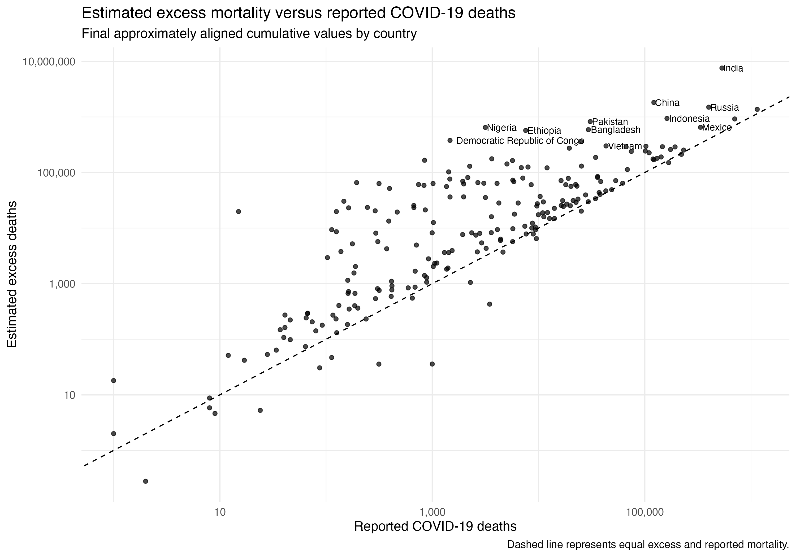
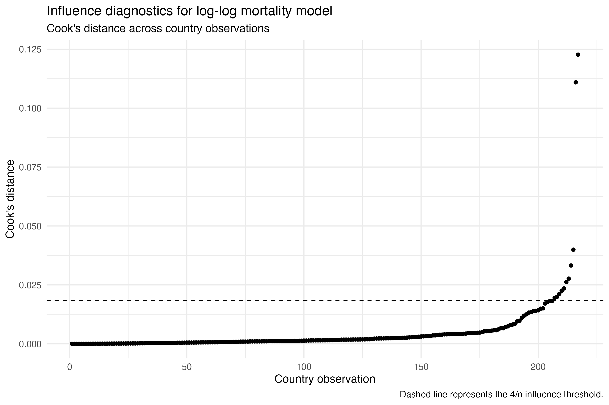
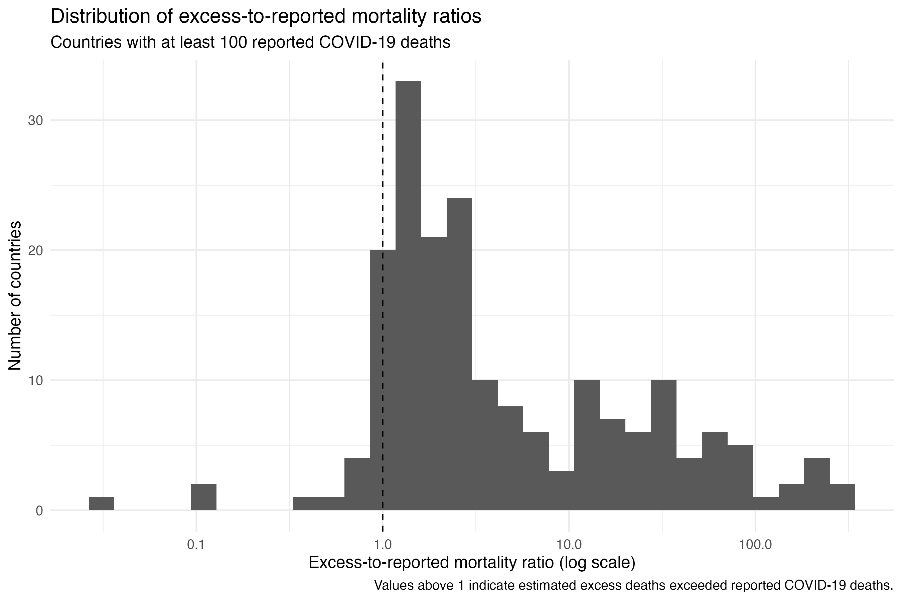
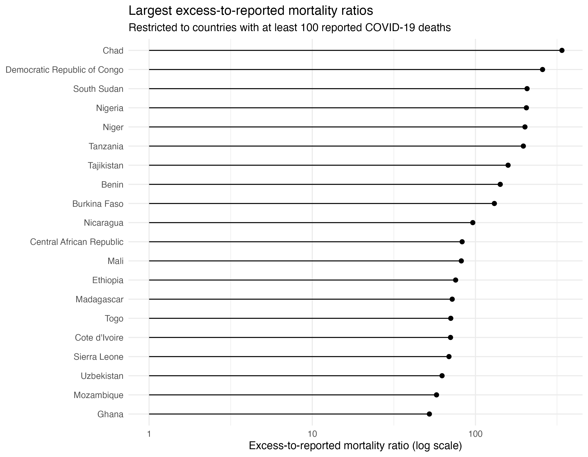
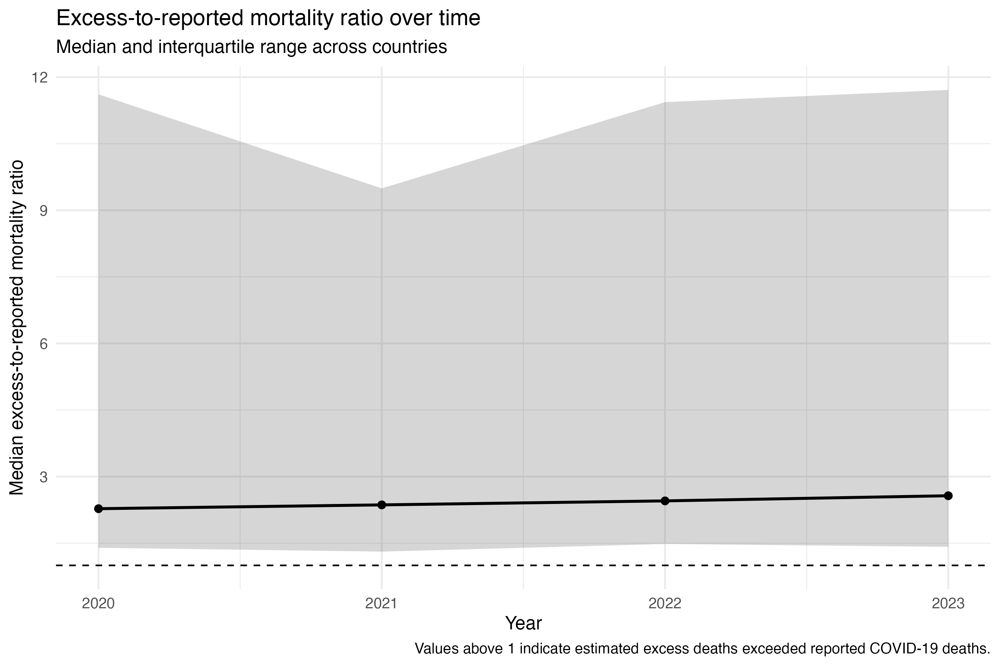
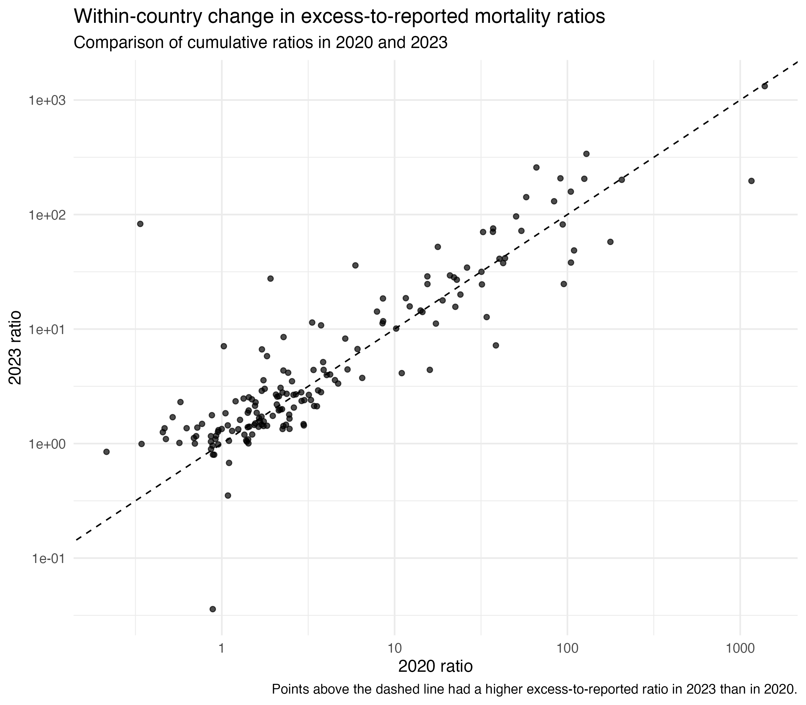
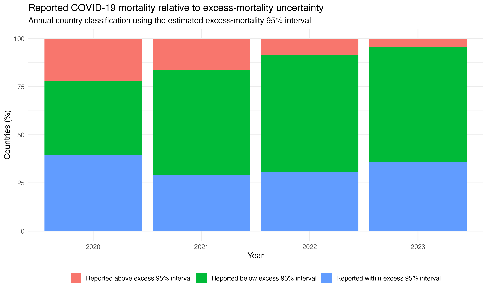

# Excess Mortality vs Reported COVID-19 Deaths

An epidemiological analysis comparing estimated excess mortality with reported COVID-19 deaths across countries from 2020–2023 using R.

## Research question

How closely did reported COVID-19 mortality reflect estimated excess mortality across countries, how large were the discrepancies between these measures, and did these discrepancies change over time?

This project combines data validation, asynchronous time-series alignment, uncertainty-aware comparison, cross-country regression, robust sensitivity analyses and paired longitudinal analysis.

The analysis explores:

- availability and structure of excess-mortality and reported COVID-19 mortality data
- alignment of asynchronous cumulative mortality series
- the magnitude of excess mortality relative to reported COVID-19 deaths
- whether reported mortality lies within the estimated excess-mortality 95% interval
- correlation between reported COVID-19 deaths and excess mortality
- log-log regression of mortality burden
- robustness to influential observations
- sensitivity to small reported-death denominators
- change in cumulative mortality discrepancies from 2020–2023
- persistence of discrepancies across multiple years

---

# Data

The source dataset:

```text
4- excess-deaths-cumulative-economist-single-entity.csv
```

The raw dataset:

```text
93,353 observations
253 entities
7 variables
```

Time period:

```text
1 January 2020 to 31 December 2023
```

Principal variables:

```text
Entity
Code
Day
cumulative_estimated_daily_excess_deaths
Total confirmed deaths due to COVID-19
cumulative_estimated_daily_excess_deaths_ci_95_top
cumulative_estimated_daily_excess_deaths_ci_95_bot
```

The excess-mortality series included both a point estimate and 95% uncertainty bounds.

---

# Initial data audit

The raw data contained both individual countries and aggregate geographic or income groups.

Fifteen uncoded aggregate entities were identified:

```text
Africa
Asia
Europe
European Union
High income
Low income
Lower middle income
North America
Oceania
South America
Upper middle income
World excl. China
```

The supplied `World` series was excluded from the primary country-level analysis.

After removing aggregate observations, the country-level dataset contained:

```text
89,860 observations
237 coded entities
```

---

# Missingness and time-series structure

A major feature of the dataset was that estimated excess mortality and reported COVID-19 deaths were not populated on the same rows.

Missingness:

| Variable | Missing | Percentage |
|---|---:|---:|
| Reported COVID-19 deaths | 48,348 | 51.8% |
| Estimated excess deaths | 45,005 | 48.2% |
| Excess mortality upper interval | 45,005 | 48.2% |
| Excess mortality lower interval | 45,005 | 48.2% |
| Code | 3,080 | 3.3% |

The two cumulative mortality series were stored as asynchronous observations.

The most common intervals between successive rows for an entity were:

```text
1 day
6 days
7 days
```

This meant that direct row-by-row comparison would have produced inappropriate missingness and mismatched dates.

---

# Data quality checks

The dataset:

```text
0 completely duplicated rows
0 duplicated entity-date observations
```

The excess-mortality confidence intervals were internally consistent:

```text
0 estimates below the lower confidence bound
0 estimates above the upper confidence bound
0 lower bounds above upper bounds
```

Negative cumulative excess-mortality estimates were retained.

Raw data:

```text
8,259 observations had negative estimated excess mortality
460 were exactly zero
39,629 were positive
```

Negative excess mortality was not treated as a data-cleaning error because excess mortality represents deviation from an expected mortality baseline and can be negative.

---

# Aligning the mortality series

Given that the two cumulative measures were observed on different dates, the analysis constructed contemporaneous comparisons.

Among the 237 country-level entities:

| Availability | Countries |
|---|---:|
| Excess mortality available | 236 |
| Reported COVID mortality available | 226 |
| Both measures available | 225 |
| Excess mortality only | 11 |
| Reported mortality only | 1 |

The earlier of the final available dates for the two mortality series was defined as a common cutoff.

The latest available observation for each mortality measure at or before this cutoff was selected.

Thus, this resulted in:

```text
225 final paired country observations
```

All final pairs were within:

```text
6 days
```

---

# Annual alignment

The same common-cutoff strategy was applied separately within each calendar year.

| Year | Paired entities | Median date difference | Maximum difference | Within 14 days |
|---|---:|---:|---:|---:|
| 2020 | 196 | 6 days | 6 days | 100% |
| 2021 | 212 | 6 days | 6 days | 100% |
| 2022 | 224 | 6 days | 6 days | 100% |
| 2023 | 225 | 6 days | 6 days | 100% |

This allowed cumulative reported COVID-19 mortality and cumulative estimated excess mortality to be compared at approximately equivalent points in time.

---

# Cross-country comparison

For ratio and log-scale analyses, countries were restricted to those with positive values for both measures.

This produced:

```text
217 countries
```

Median excess-to-reported mortality ratio:

```text
2.57
```

Interquartile range:

```text
1.42–11.7
```

Across these countries:

```text
90.8%
```

had estimated excess mortality greater than reported COVID-19 mortality.

---

# Excess mortality uncertainty intervals

Reported COVID-19 mortality was compared with the 95% uncertainty interval around the excess-mortality estimate.

| Position of reported COVID deaths | Countries | Percentage |
|---|---:|---:|
| Below excess-mortality 95% interval | 134 | 59.6% |
| Within excess-mortality 95% interval | 81 | 36.0% |
| Above excess-mortality 95% interval | 10 | 4.4% |

In a majority of countries, reported COVID-19 mortality was below even the lower bound of the estimated excess-mortality interval.

This should not be interpreted as direct evidence that all additional excess deaths were unreported COVID-19 deaths.

Excess mortality may include direct COVID-19 mortality, indirect effects of the pandemic, changes in other causes of death and uncertainty arising from the excess-mortality model itself.

---

# Excess mortality versus reported COVID-19 deaths



Countries with greater reported COVID-19 mortality generally had greater estimated excess mortality.

Substantial departures from the equality line were visible across countries.

```text
Correlation does not equal agreement.
```

Two mortality measures may rank countries similarly while differing in absolute magnitude.

---

# Correlation analysis

The Spearman rank correlation between reported COVID-19 deaths and estimated excess deaths:

```text
rho = 0.799
p = 2.23 × 10^-49
```

This indicates a strong monotonic cross-country association.

Pearson correlation was calculated after log10 transformation:

```text
r = 0.833
95% CI = 0.788–0.870
p = 2.64 × 10^-57
```

Both analyses showed a strong relationship between the two mortality measures.

---

# Log-log regression

A linear model was fitted with outcome:

```text
log10(estimated excess deaths)
```

Predictor:

```text
log10(reported COVID-19 deaths)
```

The fitted slope was:

```text
0.900
95% CI = 0.820–0.980
p = 2.64 × 10^-57
```

The model explained approximately:

```text
R² = 0.695
```

of cross-country variation in log-transformed estimated excess mortality.

Because both variables were log10 transformed, the slope can be interpreted in a multiplicative manner.

A tenfold increase in reported COVID-19 deaths was associated with around:

```text
10^0.900 ≈ 7.9-fold
```

higher estimated excess mortality.

---

# Robust regression

Some countries had unusually large discrepancies. This could exert influence on the ordinary least-squares model.

A robust regression model was fitted in view of this.

The estimated slopes were:

| Model | Slope |
|---|---:|
| Ordinary least squares | 0.900 |
| Robust regression | 0.915 |

The similarity of these estimates suggests that the main cross-country relationship was not dependent on a small number of extreme observations.

---

# Influence diagnostics

Cook's distance was used to identify observations with disproportionate influence on the ordinary linear regression.

Eleven countries exceeded the conventional threshold below:

```text
4 / n
```

Countries had either:

- very small absolute mortality counts; or
- extremely large discrepancies between excess and reported mortality.

Examples:

```text
Burundi
Chad
South Sudan
Tajikistan
Cook Islands
Kiribati
Palau
Luxembourg
Nauru
New Caledonia
Wallis and Futuna
```



---

# Influence sensitivity analysis

The regression was re-estimated after excluding countries above the Cook's-distance threshold.

| Analysis | Countries | Slope |
|---|---:|---:|
| Primary model | 217 | 0.900 |
| Excluding influential observations | 206 | 0.870 |

The association remained similar after removing influential observations.

This supports the interpretation that the overall cross-country association was not driven solely by a small number of high-leverage countries.

---

# Extreme discrepancies

Some countries had particularly large absolute differences between estimated excess mortality and reported COVID-19 mortality.

Examples:

```text
India
China
Russia
Pakistan
Indonesia
Nigeria
Ethiopia
Bangladesh
Democratic Republic of Congo
Egypt
Mexico
Vietnam
Myanmar
United States
Philippines
Brazil
South Africa
Uganda
Tanzania
Japan
```

Large ratios were especially evident in settings with relatively low reported COVID-19 mortality.

Among countries with at least 100 reported deaths:

```text
Chad
Democratic Republic of Congo
South Sudan
Nigeria
Niger
Tanzania
Tajikistan
Benin
Burkina Faso
Nicaragua
```

These ratios should be interpreted as discrepancies between two mortality measures and not direct estimates of under-reporting.

---

# Distribution of excess-to-reported ratios



The distribution was highly right-skewed.

Although the median ratio was approximately 2.6, some countries had values above this level.

A log-scale axis was used to display the wide range of discrepancies.

---

# Largest relative discrepancies



To reduce instability from extremely small reported mortality denominators, the principal ranking of relative discrepancies was restricted to countries with at least:

```text
100 reported COVID-19 deaths
```

---

# Denominator sensitivity analysis

Ratio estimates can become unstable when the denominator is very small.

The analysis was repeated at progressively higher minimum reported-death thresholds.

| Minimum reported deaths | Countries | Median ratio | IQR | Excess > reported |
|---:|---:|---:|---:|---:|
| 1 | 217 | 2.57 | 1.42–11.7 | 90.8% |
| 100 | 191 | 2.59 | 1.42–14.4 | 92.1% |
| 1,000 | 133 | 2.29 | 1.36–7.08 | 91.7% |
| 10,000 | 66 | 1.63 | 1.32–3.31 | 93.9% |

The finding that excess mortality generally exceeded reported COVID-19 mortality remained consistent across denominator thresholds.

The magnitude of the median ratio became smaller at the highest threshold, indicating that extremely large ratios were more common among countries with lower reported mortality counts.

---

# Temporal analysis

The analysis next examined whether cumulative discrepancies changed from 2020–2023.

Annual endpoint comparisons used the country-specific common-cutoff method described above.

---

# Cumulative excess-to-reported ratio over time

| Year | Positive paired countries | Median ratio | IQR | Excess > reported |
|---|---:|---:|---:|---:|
| 2020 | 169 | 2.28 | 1.40–11.6 | 71.4% |
| 2021 | 204 | 2.36 | 1.31–9.49 | 80.7% |
| 2022 | 214 | 2.45 | 1.48–11.4 | 86.2% |
| 2023 | 217 | 2.57 | 1.42–11.7 | 87.6% |

The median cumulative excess-to-reported mortality ratio increased gradually across the period.



These are cumulative mortality measures so this should not be interpreted as the ratio of deaths occurring separately within each calendar year.

Each annual value represents the cumulative discrepancy observed by approximately the end of that year.

---

# Within-country change from 2020 to 2023

A paired analysis was performed among countries with valid positive ratios in both 2020 and 2023.

```text
169 countries
```

Median ratio:

```text
2020: 2.28
2023: 2.66
```

Across these countries:

```text
57.4% had a higher ratio in 2023
42.6% had a lower ratio in 2023
```



---

# Paired Wilcoxon analysis

The within-country change in log excess-to-reported ratio was assessed using a paired Wilcoxon signed-rank test.

```text
W = 9272
p = 0.00104
```

This provides evidence that the within-country distribution of cumulative mortality ratios differed between 2020 and 2023.

---

# Persistence of discrepancy

The analysis examined whether countries repeatedly had reported COVID-19 mortality below the estimated excess-mortality 95% interval.

Among countries with at least three years of paired data:

```text
212 countries were eligible
```

```text
113
```

were below the excess-mortality interval in at least three observed years.

```text
53.3%
```

of countries with sufficient longitudinal data.

This indicates that discrepancies between reported COVID mortality and estimated excess mortality were often persistent rather than isolated to a single annual comparison.

---

# Annual uncertainty classification



This visualises how the proportion of countries whose reported mortality fell below, within or above the estimated excess-mortality interval changed over time.

---

# Analytical workflow

## 01_data_audit.R

- dimensions
- date coverage
- entity coverage
- aggregate observations
- missingness
- duplicate rows
- duplicate entity-date observations
- time spacing between observations
- negative excess-mortality estimates
- confidence-interval validity
- coverage of both mortality series

---

## 02_data_cleaning_and_alignment.R

- renaming variables
- excluding aggregate entities
- retaining negative excess-mortality estimates
- identifying availability of each mortality series
- constructing country-specific common cutoff dates
- extracting approximately contemporaneous cumulative values
- calculating absolute and relative discrepancies
- classifying reported mortality relative to excess-mortality uncertainty intervals
- producing annually aligned paired datasets

---

## 03_cross_country_discrepancy.R

- excess-to-reported ratios
- uncertainty-interval classification
- Spearman correlation
- Pearson correlation on log-transformed values
- log-log linear regression
- robust regression
- Cook's-distance influence diagnostics
- influence-exclusion sensitivity analysis
- denominator-threshold sensitivity analysis
- absolute and relative discrepancy rankings

---

## 04_temporal_discrepancy.R

- annual cumulative ratio summaries
- annual excess-mortality interval classification
- paired 2020 versus 2023 comparisons
- paired Wilcoxon signed-rank testing
- persistence of discrepancy across repeated annual observations

---

# Repository structure

```text
excess-mortality-vs-reported-covid/
│
├── data/
│   ├── raw/
│   │   └── 4- excess-deaths-cumulative-economist-single-entity.csv
│   │
│   └── processed/
│       ├── covid_excess_country.csv
│       ├── covid_excess_final_paired.csv
│       ├── covid_excess_annual_paired.csv
│       ├── covid_excess_comparison.csv
│       └── covid_ratio_2020_2023_paired.csv
│
├── R/
│   ├── 01_data_audit.R
│   ├── 02_data_cleaning_and_alignment.R
│   ├── 03_cross_country_discrepancy.R
│   └── 04_temporal_discrepancy.R
│
├── plots/
│   ├── 01_excess_vs_reported_covid_deaths.png
│   ├── 02_excess_reported_ratio_distribution.png
│   ├── 03_largest_relative_discrepancies.png
│   ├── 04_regression_influence_diagnostics.png
│   ├── 05_annual_excess_reported_ratio.png
│   ├── 06_annual_interval_classification.png
│   └── 07_2020_vs_2023_ratio_change.png
│
├── tables/
│   └── analysis outputs
│
└── README.md
```

---

# Epidemiological considerations

## Excess mortality is not equivalent to COVID-19 mortality

Estimated excess mortality represents the difference between observed or modelled mortality during the pandemic period and expected mortality in the absence of the pandemic.

It may include:

- deaths directly caused by COVID-19
- indirect mortality associated with disrupted healthcare
- changes in deaths from other causes
- mortality reductions in some causes
- uncertainty associated with the counterfactual mortality model

The excess-to-reported ratio should not be interpreted as a direct measure of COVID-19 death under-reporting.

---

## Reported COVID mortality is also imperfect

It depends on the following:

- testing availability
- surveillance systems
- death certification
- reporting practices
- diagnostic access
- national definitions of a COVID-19 death

Differences between countries may reflect surveillance processes, measurement processes,  and true epidemiological differences.

---

## Correlation and agreement are different

The two mortality measures were strongly correlated across countries.

Strong correlation does not imply numerical agreement.

Countries can rank similarly on both measures while still having substantial differences in mortality magnitude.

This distinction is key to the interpretation of the analysis.

---

## Ratios are denominator-sensitive

Very large excess-to-reported ratios can arise when reported COVID-19 mortality is small.

The analysis included threshold sensitivity analyses using minimum reported-death counts of:

```text
1
100
1,000
10,000
```

The overall conclusion remained consistent, although extreme ratios became less prominent at higher denominator thresholds.

---

## Excess-mortality estimates contain uncertainty

The excess-mortality dataset provides 95% uncertainty intervals.

Reported COVID-19 mortality was compared with its uncertainty bounds as well.

This avoids treating all modelled excess-mortality estimates as exact values.

---

## Cross-country observations are heterogeneous

Countries differ in: 

- population size
- age structure
- health-system capacity
- epidemic timing
- surveillance quality
- baseline mortality patterns
- data quality

This means that our present analysis is descriptive and ecological.

It does not estimate causal effects of reporting systems or health-system characteristics.

---

## Cumulative values require careful temporal interpretation

The annual comparison uses cumulative mortality values observed near the end of each year.

The apparent increase in the excess-to-reported ratio from 2020–2023 represents change in cumulative discrepancy, not independent year-specific mortality ratios.

---

# Statistical methods demonstrated

- data auditing
- missingness assessment
- asynchronous time-series alignment
- country-specific common cutoffs
- uncertainty-aware epidemiological comparison
- absolute differences
- mortality ratios
- log transformation
- Spearman rank correlation
- Pearson correlation
- log-log linear regression
- robust regression
- Cook's-distance influence diagnostics
- influence sensitivity analysis
- denominator-threshold sensitivity analysis
- paired longitudinal comparison
- Wilcoxon signed-rank testing
- persistence analysis

---

# Tools

Analysis was conducted in R using packages:

```r
tidyverse
here
scales
MASS
broom
lubridate
```

Visualisations were produced using `ggplot2`.

---

# Reproducibility

To reproduce the analysis:

1. Clone the repository.
2. Open the project in R or RStudio.
3. Place the source dataset in:

```text
data/raw/
```

4. Install the required R packages.
5. Run the scripts sequentially:

```r
source("R/01_data_audit.R")
source("R/02_data_cleaning_and_alignment.R")
source("R/03_cross_country_discrepancy.R")
source("R/04_temporal_discrepancy.R")
```

Processed datasets, tables and figures will be generated automatically in their respective directories.

